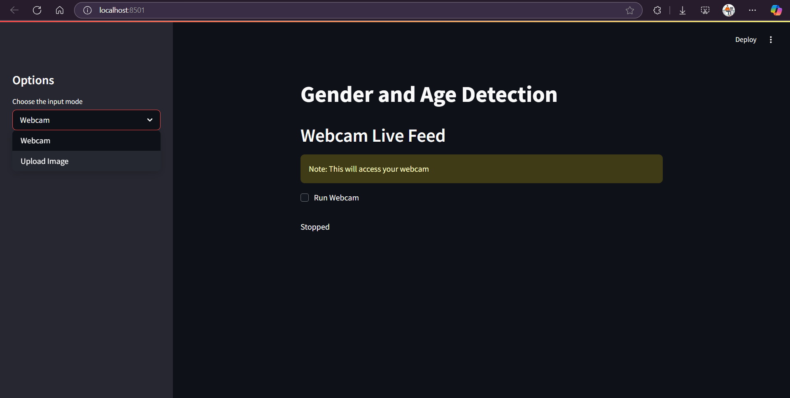
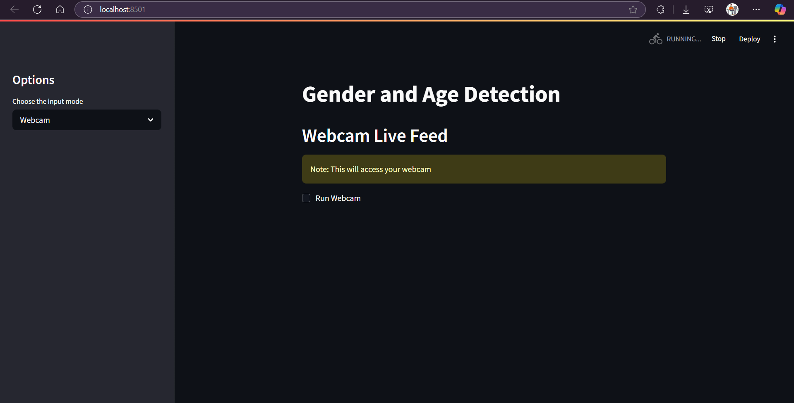
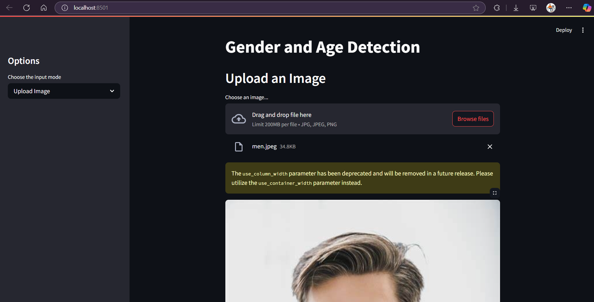
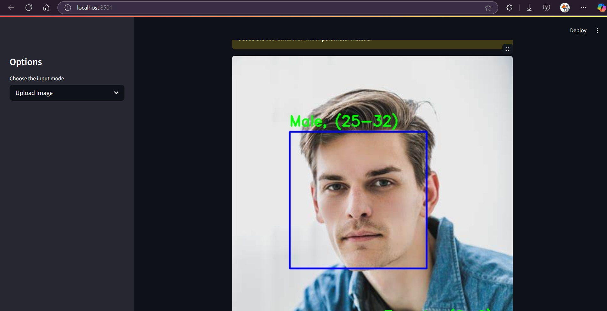
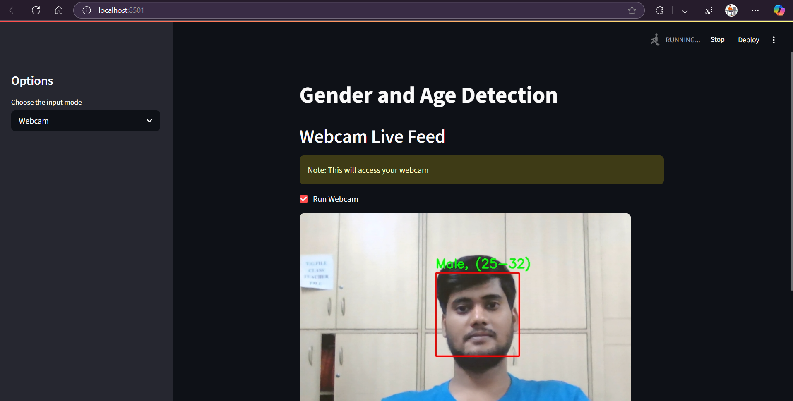

# Gender-and-Age-Detection

This project performs real-time gender and age detection using deep learning models. Built with Streamlit for an interactive interface, it supports two input modes: Webcam Live Feed and Image Upload. The system detects faces in the input and predicts both gender and age group (e.g., Male, 25–32) using pre-trained CNN models. It's ideal for intelligent human-computer interaction, surveillance, or demographic analytics.

